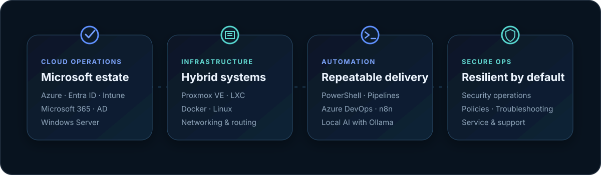

<div align="center">
  
</div>

<br />

<div align="center">
  <h1>Hi, I'm Sergiu 👋</h1>
  <p><strong>IT System-Engineer · Microsoft Infrastructure · Automation · Security</strong></p>
  <p>
    Building reliable systems from the network layer to the cloud,<br />
    with a practical focus on maintainability, security and thoughtful automation.
  </p>
</div>

<br />

## About me

I'm an **IT System-Engineer** based near Stuttgart, Germany, with a background as an **IT specialist for systems integration (FISI)**. I work with Microsoft infrastructure, virtualization, networking, security and automation. On GitHub, I document hands-on systems work, technical experiments and ideas I explore along the way.

<br />

## Current focus

<div align="center">
  
</div>

<br />

## Technical toolkit

| Systems & Cloud | Infrastructure | Automation & Delivery | Security & Operations |
|:--|:--|:--|:--|
| Microsoft Azure | Proxmox VE & LXC | Windows PowerShell | Security Operations |
| Microsoft Entra ID | Docker & Compose | Azure DevOps Server | Cybersecurity |
| Windows Server | Linux | Pipelines | IT Security Policies |
| Active Directory | Networking & Routing | n8n | Troubleshooting |
| Intune & Microsoft 365 | Citrix & VMware | Ollama / Local AI | Service Desk |

<br />

## How I work

```text
understand the system  →  reduce the complexity  →  automate the repeatable  →  secure the result
```

I value clear documentation, practical problem solving, responsible system stewardship and dependable support. Teamwork matters just as much as the technology behind the solution.

<br />

<div align="center">
  <sub>Stuttgart, Germany · German & English</sub><br />
  <sub>Thanks for stopping by. More documented projects are on the way.</sub><br /><br />
  <a href="https://github.com/ManuTaycan?tab=repositories"><strong>Explore my repositories →</strong></a>
</div>

